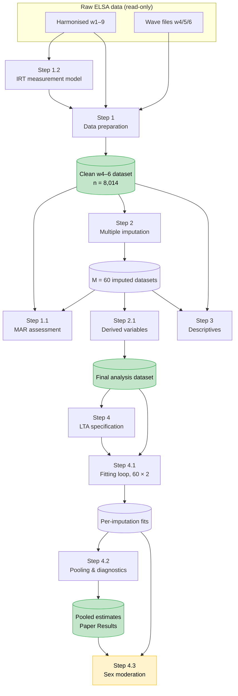

# Data Flow Diagram — ELSA Chronic Pain LTA Pipeline

**Date:** 2026-09-28

A detailed variant, showing per-stage derivations and intermediate artefacts, is in
[`data_flow_detailed.md`](data_flow_detailed.md).

---

---

## Pipeline stages

| Stage | File | Produces |
|---|---|---|
| 1.2 | [`IMPACT_IRT_Measurement_invariance.Rmd`](../IMPACT_IRT_Measurement_invariance.Rmd) + [`IMPACT_IRT_scoresExtraction.R`](../IMPACT_IRT_scoresExtraction.R) | `impactEstimates2-8_partialScalar.rds` — IRT pain-impact scores |
| 1 | [`suppl_pt1_Data_prep.Rmd`](../suppl_pt1_Data_prep.Rmd) | `H_elsa_w4_6.rds` — clean w4–6 dataset (n = 8,014); `H_elsa_w1.rds` |
| 1.1 | [`suppl_pt1.1_MAR_exploration.Rmd`](../suppl_pt1.1_MAR_exploration.Rmd) | `output/supplementary_MAR.docx` — Supplementary Material 1.1 |
| 2 | [`suppl_pt2_IMPUTATION_MICE_long.Rmd`](../suppl_pt2_IMPUTATION_MICE_long.Rmd) | `mice_imputationlong_VH.rds` — M = 60 imputed datasets |
| 2.1 | [`suppl_pt2.1_DERIVED VARIABLES_VH.Rmd`](../suppl_pt2.1_DERIVED%20VARIABLES_VH.Rmd) | `mice_updatedMIDS_VH.rds` — final analysis dataset |
| 3 | [`suppl_pt3_change of pain classes_descriptives_VH.Rmd`](../suppl_pt3_change%20of%20pain%20classes_descriptives_VH.Rmd) | Table 1, missingness and pain-class summaries |
| 4 | [`suppl_pt4_LTA_models.Rmd`](../suppl_pt4_LTA_models.Rmd) | Model specification; single-imputation fits; noEXP nested LRTs |
| 4.1 | [`suppl_pt4.1_imputation_loop.r`](../suppl_pt4.1_imputation_loop.r) (`Myriad_scripts/` on the cluster) | `raw_results_{TE,DE}_imp{i}.rds`, i = 1…60 |
| 4.2 | [`suppl_pt4.2_LTA_post_processing_pool.Rmd`](../suppl_pt4.2_LTA_post_processing_pool.Rmd) | `pooled_TE.rds` / `pooled_DE.rds` — paper estimates; diagnostics; TE vs DE LRT |
| 4.3 | [`suppl_pt4.3_Sex_Mod.Rmd`](../suppl_pt4.3_Sex_Mod.Rmd), [`SexMod_alltoHICP.r`](../SexMod_alltoHICP.r) | Sex moderation tables *(exploratory)* |

Helper functions used throughout: [`Sources/Paper1_func.R`](../Sources/Paper1_func.R).

**Data paths** (external to the repo):
`rds_path` = `~/private_WP5/WP5_data/rds/` ·
`models_path` = `~/private_WP5/WP5_data/model_fits/imputations/` ·
`summary_path` = `~/private_WP5/WP5_data/model_fits/imputation_summaries/`
