```mermaid
flowchart TD

    %% ─────────────────────────────────────────────
    %%  STAGE 0 — Raw inputs
    %% ─────────────────────────────────────────────
    subgraph RAW[" Raw ELSA Data (read-only)"]
        direction TB
        HARM["Harmonised ELSA WAVE1–9\nHg3_WAVE1_9_ALL.tab"]
        TABS["Wave-specific tab files\nw4/5/6 core · nurse · financial\n(8 files)"]
    end

    %% ─────────────────────────────────────────────
    %%  STAGE 1.2 — Measurement invariance & IRT
    %% ─────────────────────────────────────────────
    subgraph IRT["Step 1.2 — IRT Measurement Model"]
        direction TB
        PT12["Measurement_invariance_IRT.Rmd"]
        EXTRACT["Meas.Inv.IRTscoreExtraction.R"]
        IRT_RDS[("impactEstimates2-8\n_partialScalar.rds")]
        PT12 --> EXTRACT
        EXTRACT --> IRT_RDS
    end

    %% ─────────────────────────────────────────────
    %%  STAGE 1 — Data preparation
    %% ─────────────────────────────────────────────
    subgraph PREP["Step 1 — Data Preparation"]
        direction TB
        CESD_MOD[("cesd_lat_metricInv\n_fit20260313.rds\n(pre-fitted CFA)")]
        PT1["suppl_pt1_Data_prep.Rmd\n· variable derivation\n· sample selection w4–6\n· chronic pain classification\n· MLTC · depression · partner"]
        WAVE1[("H_elsa_WAVE1.rds")]
        WAVE46[("H_elsa_w4_6.rds\n Clean w4–6 dataset\nn = 8,014")]
        CESD_MOD --> PT1
        PT1 --> WAVE1
        PT1 --> WAVE46
    end

    %% ─────────────────────────────────────────────
    %%  STAGE 1.1 — Missing At Random assessment
    %% ─────────────────────────────────────────────
    subgraph MARST["Step 1.1 — MAR Assessment"]
        direction TB
        MAR["suppl_pt1.1_MAR_exploration.Rmd\n· missingness by wave × mode\n· GEE missingness models\n· Bondarenko-Raghunathan plots"]
        MARDOC["output/supplementary_MAR.docx\nSupplementary Material 1.1"]
        MAR --> MARDOC
    end

    %% ─────────────────────────────────────────────
    %%  STAGE 2 — Multiple imputation
    %% ─────────────────────────────────────────────
    subgraph IMPUTE["Step 2 — Multiple Imputation (MICE)"]
        direction TB
        PT2["suppl_pt2_IMPUTATION\n_MICE_long.Rmd\n· wide → long format\n· 2-level FCS imputation\n· conditional imputation\n  (partner support | partner)"]
        MICE[("mice_imputationlong_VH.rds\nM = 60 imputed datasets")]
        PT2 --> MICE
    end

    %% ─────────────────────────────────────────────
    %%  STAGE 2.1 — Derived variables
    %% ─────────────────────────────────────────────
    subgraph DERIVE["Step 2.1 — Derived Variables"]
        direction TB
        STAB[("Impact_clustStability\n_boot2000.rds")]
        PT21["suppl_pt2.1_DERIVED\nVARIABLES_VH.Rmd\n· lvimp_shifted_cat3 (PAM w4 medoids)\n· wealthQ_bin (most deprived quintile)\n· time · Sex_BIN · raagey_z"]
        MIDS[("mice_updatedMIDS_VH.rds\n Final analysis dataset")]
        STAB --> PT21
        PT21 --> MIDS
    end

    %% ─────────────────────────────────────────────
    %%  STAGE 3 — Descriptives
    %% ─────────────────────────────────────────────
    subgraph DESC["Step 3 — Descriptive Statistics"]
        PT3["suppl_pt3_change of pain classes\n_descriptives_VH.Rmd\n· Table 1 · missingness\n· pain class summaries"]
    end

    %% ─────────────────────────────────────────────
    %%  STAGE 4 — LTA model specification
    %% ─────────────────────────────────────────────
    subgraph LTA["Step 4 — LTA Model Specification"]
        direction TB
        PT4["suppl_pt4_LTA_models.Rmd\n· ssupport6_cat derivation (median cut)\n· k = 4 state selection\n· TE and DE formulas\n· noEXP nested models + LRT"]
        SINGLE[("TotalEffects.rds · DirectEffects.rds\nTotalEffects_{init,trans}_noEXP.rds\n(single-imputation fits)")]
        PT4 --> SINGLE
    end

    %% ─────────────────────────────────────────────
    %%  STAGE 4.1 — Fitting loop across imputations
    %% ─────────────────────────────────────────────
    subgraph FIT["Step 4.1 — Fitting Loop (60 × 2 models)"]
        direction TB
        PT41["suppl_pt4.1_imputation_loop.r\n· multi-start lmest per imputation"]
        RAW_RES[("imputations/\nraw_results_{TE,DE}_imp{i}.rds\ni = 1…60")]
        PT41 --> RAW_RES
    end

    %% ─────────────────────────────────────────────
    %%  STAGE 4.2 — Post-processing and pooling
    %% ─────────────────────────────────────────────
    subgraph POOL["Step 4.2 — Post-processing & MI Pooling"]
        direction TB
        PT42["suppl_pt4.2_LTA_post_processing\n_pool.Rmd\n· severity re-ordering + refit\n· LL & ordering consistency checks\n· Rubin's rules (mice::pool.scalar)\n· diagnostics · TE vs DE LRT (D2)"]
        SUMM[("imputation_summaries/\nsummaries_{TE,DE}_imp{i}.rds\nstate_order_log_{TE,DE}.rds")]
        POOLED[("pooled_TE.rds · pooled_DE.rds\n Paper estimates\nTE_DE_all_best_LLs.rds\nmodel_diagnostics_per_imp.rds\ndesc1.1_* count tables")]
        PT42 --> SUMM
        PT42 --> POOLED
    end

    %% ─────────────────────────────────────────────
    %%  STAGE 4.3 — Sex moderation
    %% ─────────────────────────────────────────────
    subgraph SEXMOD["Step 4.3 — Sex Moderation (exploratory)"]
        PT43["suppl_pt4.3_Sex_Mod.Rmd\nSexMod_alltoHICP.r\n· multinomial logit on Viterbi states\n· descriptive transition proportions"]
    end


    %% ─────────────────────────────────────────────
    %%  CONNECTIONS BETWEEN STAGES
    %% ─────────────────────────────────────────────
    HARM --> PT12
    HARM --> PT1
    TABS --> PT1
    IRT_RDS --> PT1

    WAVE46 --> MAR
    WAVE46 --> PT2
    WAVE46 --> PT3
    WAVE1  --> PT3

    MICE --> MAR
    MICE --> PT21
    MICE --> PT3

    MIDS --> PT4
    MIDS --> PT41
    MIDS --> PT43

    RAW_RES --> PT42
    SUMM --> PT42
    RAW_RES --> PT43
    POOLED --> PT43

    %% ─────────────────────────────────────────────
    %%  STYLING
    %% ─────────────────────────────────────────────
    style WAVE46    fill:#c3e6cb,stroke:#28a745,color:#000,font-weight:bold
    style MIDS   fill:#c3e6cb,stroke:#28a745,color:#000,font-weight:bold
    style POOLED fill:#c3e6cb,stroke:#28a745,color:#000,font-weight:bold

    style SEXMOD fill:#fff9e6,stroke:#ffc107
    style PT43   fill:#fff3cd,stroke:#ffc107,color:#000
```

# Data Flow Diagram (detailed variant) — ELSA Chronic Pain LTA Pipeline

**Date:** 2026-09-28

---

---

## Pipeline stages

| Stage | File | Key output |
|---|---|---|
| 1.2 | `Measurement_invariance_IRT.Rmd` + `Meas.Inv.IRTscoreExtraction.R` | `impactEstimates2-8_partialScalar.rds` |
| 1 | `suppl_pt1_Data_prep.Rmd` | `H_elsa_w4_6.rds`clean w4–6 dataset (n = 8,014) |
| 1.1 | `suppl_pt1.1_MAR_exploration.Rmd` | `output/supplementary_MAR.docx` (Supplementary Material 1.1) |
| 2 | `suppl_pt2_IMPUTATION_MICE_long.Rmd` | `mice_imputationlong_VH.rds` (M = 60) |
| 2.1 | `suppl_pt2.1_DERIVED VARIABLES_VH.Rmd` | `mice_updatedMIDS_VH.rds`final analysis dataset |
| 3 | `suppl_pt3_change of pain classes_descriptives_VH.Rmd` | Table 1 / figures (no RDS output) |
| 4 | `suppl_pt4_LTA_models.Rmd` | model specification; single-imputation fits + noEXP LRTs |
| 4.1 | `suppl_pt4.1_imputation_loop.r` (`Myriad_scripts/` on the cluster) | `raw_results_{TE,DE}_imp{i}.rds`, i = 1…60 |
| 4.2 | `suppl_pt4.2_LTA_post_processing_pool.Rmd` | `pooled_TE.rds` / `pooled_DE.rds`paper estimates |
| 4.3 | `suppl_pt4.3_Sex_Mod.Rmd`, `SexMod_alltoHICP.r` *(exploratory)* | sex moderation tables (no RDS output) |

**Data paths** (all external to the repo):
`rds_path` = `~/private_WP5/WP5_data/rds/` ·
`models_path` = `~/private_WP5/WP5_data/model_fits/imputations/` ·
`summary_path` = `~/private_WP5/WP5_data/model_fits/imputation_summaries/`
