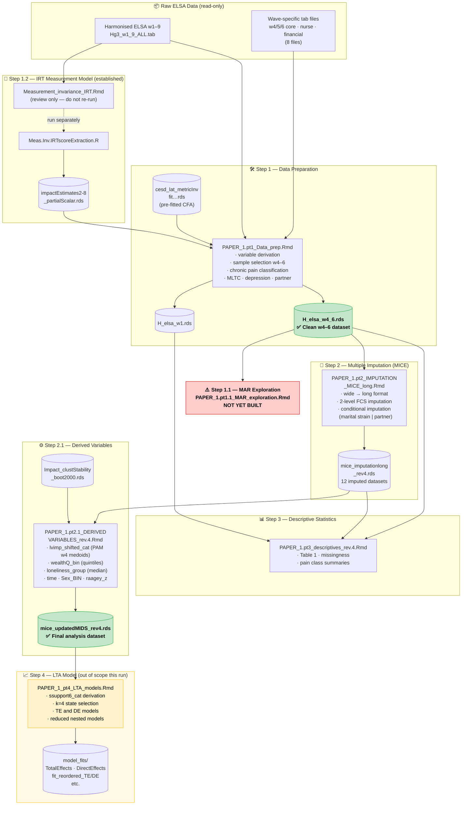

# Data Flow Diagram — ELSA Chronic Pain LTA Pipeline

**Date:** 2026-03-16

---

---

## Pipeline stages

| Stage | File | Key output |
|---|---|---|
| 1.2 | `Measurement_invariance_IRT.Rmd` + `Meas.Inv.IRTscoreExtraction.R` | `impactEstimates2-8_partialScalar.rds` |
| 1 | `PAPER_1.pt1_Data_prep.Rmd` | `H_elsa_w4_6.rds` ✅ clean w4–6 dataset |
| **1.1** | **⚠️ NOT YET BUILT** | MAR exploration Rmd |
| 2 | `PAPER_1.pt2_IMPUTATION_MICE_long.Rmd` | `mice_imputationlong_rev4.rds` |
| 2.1 | `PAPER_1.pt2.1_DERIVED VARIABLES_rev.4.Rmd` | `mice_updatedMIDS_rev4.rds` ✅ final analysis dataset |
| 3 | `PAPER_1.pt3_…_descriptives_rev.4.Rmd` | tables / figures (no RDS output) |
| 4 | `PAPER_1_pt4_LTA_models.Rmd` *(out of scope)* | fitted LTA model RDS files |

All `eval=F` save chunks are intentional re-run guards — output files pre-exist on disk.
